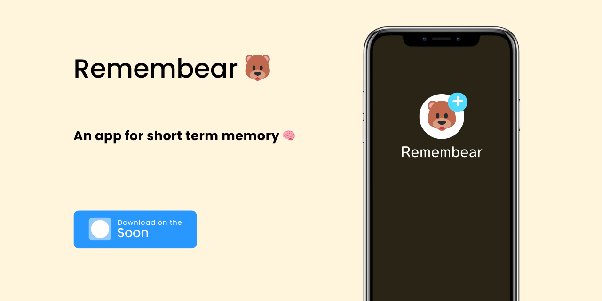

# Remembear: An app for people with short term memory 🧠

    

## Table of Contents 📚

- [Introduction](#introduction-)
- [Special Thanks](#special-thanks-)
- [Demo](#demo-)
- [Getting Started](#getting-started-)
- [Contributing](#contributing-)
- [Built with](#built-with-)
- [Other links](#links)

## Introduction 📖

*Remembear* is an app that helps you to remember things in short term memory. It's a simple app that can be used in
daily
life to remember things like shopping list, to-do list, or any other things that you want to remember in short term.

> [!NOTE]
> The Remembear repository now also depends on the Mem0AI project. We continue to maintain and support Mem0AI ❤️. You
> can find the Mem0AI repository in the [Mem0AI](https://github.com/mem0ai/mem0).

## Special Thanks 💖

Thanks for all your contributions and efforts towards improving this project 🙏

Made with [contrib.rocks](https://contrib.rocks).

## Demo 🎥

Coming soon ...

## Getting Started 🚀

To getting started, you can follow guides below:

- [Backend Server](./docs/getting-started/setup-server.md)
- [Frontend App](./docs/getting-started/setup-frontend.md)
- [Mobile App](./docs/getting-started/setup-mobile.md)

or with Docker:

- [Docker Compose](./docs/getting-started/setup-docker-compose.md)

## Contributing 🤝

> [!NOTE]
> Since the Repo is on personal account,
> to contribute to this project, you can fork this repository and create a pull request or
> you can also add your name in discussion section so that I can add you as a contributor.

We are open for ANY contributions to this project. You can contribute by:

- Reporting a bug
- Requesting a feature
- Creating a pull request
- Improving documentation
- Giving feedback
- Sharing this project
- And many more ...

## Built with 🛠

There are some technologies that used in this project:

- [Gemini API](https://gemini.google.com/)
    - Primary LLM service (currently the default is gemini-1.5-flash).
- [LiteLLM](https://litellm.com/)
    - Integrate Mem0AI with GeminiAI.
- [Mem0AI](https://github.com/mem0ai/mem0)
    - For AI contextual service libray.
- [Qdrant](https://qdrant.com/)
    - Default vector database for Mem0AI.
- [FastAPI](https://fastapi.tiangolo.com/)
    - For Backend.
- [Next.js](https://nextjs.org/)
    - For Frontend.
- [PostgreSQL](https://postgresql.org/)
    - Default Database service.
- [TailwindCSS](https://tailwindcss.com/)
    - Our favorite css library.
- [ShadcnUI](https://shadcnui.com/)
    - Our favorite Next.js component library.
- [Capacitor.js](https://capacitorjs.com/)
    - Transpile frontend into mobile app (part of Ionic).
- [Vercel](https://vercel.com/)
    - Current frontend hosting option for this project.
- [Firebase](https://firebase.google.com/)
    - Cloud Messaging / Push Notification.

## Links

- [Our Discord](https://discord.gg/h3NbgQ5G)