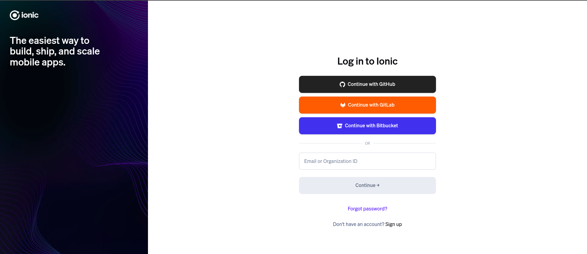
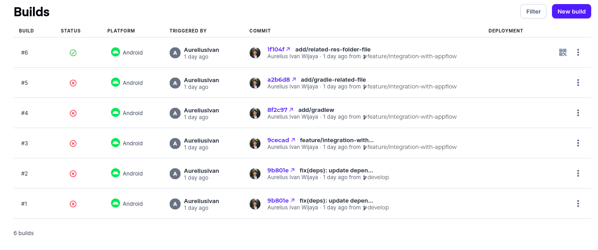

# Getting Started to build the mobile app 🚀

## Introduction

This guide will help you to build the mobile app for the project.

## Pre-requisites

- Node.js (tested with v20.11.0)
- npm & pnpm (tested with v8.15.5)
- Android Studio with Android SDK (for Android)

## How to build the mobile app

1. Run the following command to install the dependencies:

```bash
# for now we can't use npm or yarn because of the issue with the dependencies.
pnpm install
```

2. Run the following command to build the app:

```bash
pnpm run build
```

3. Run this following command to sync the app with the native project:

```bash
npx cap sync
```

4. Run the following command to open the app in the emulator:

```bash
npx cap open android

# NOTE: if you encounter an error, try manually opening the project in Android Studio
```

## How to build with Appflow

Another option to build the mobile app is by using Appflow. Appflow is a CI/CD service that can help you to build the
app automatically.

1. Sign in to [Appflow](https://ionic.io/appflow) using your Ionic account or create a new account if you don't have
   one.
   

2. Create a new app in Appflow
   

## References:

1. [Capacitor Android Documentation](https://capacitorjs.com/docs/android)
2. [Appflow](https://ionic.io/appflow)